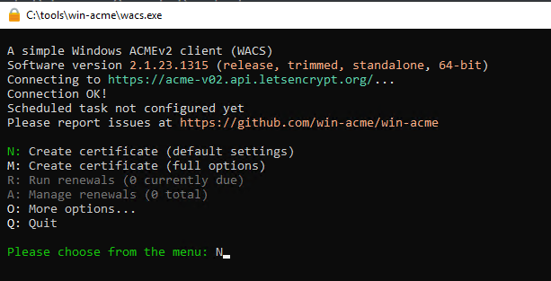
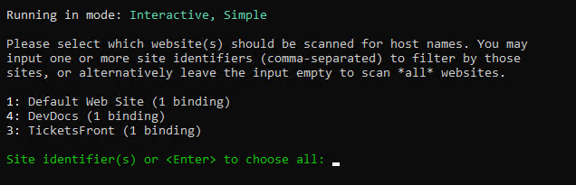
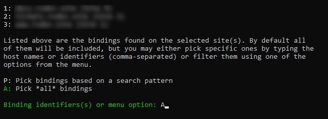
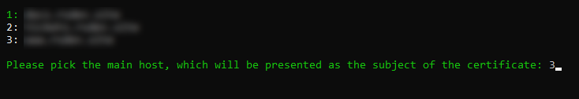
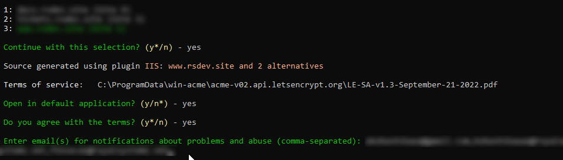
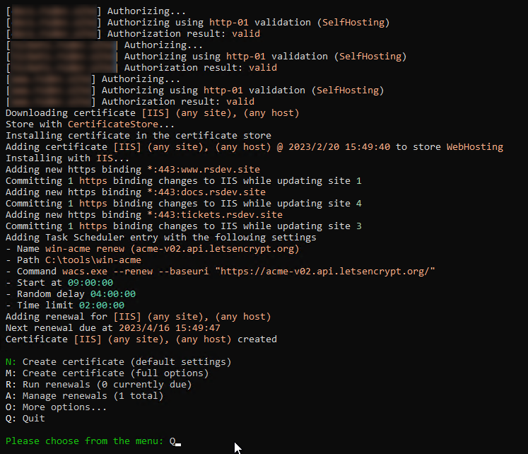
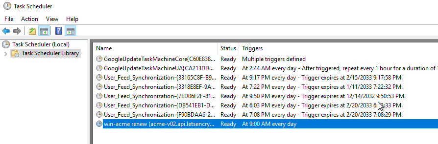

# 20230220: IIS LetsEncrypt

- Instalando certificado SSL de LetsEncript, con ayuda de [WinAcme](https://www.win-acme.com/)
- Referencias
	- [IIS - Installing the Let's Encrypt certificate](https://techexpert.tips/iis/iis-installing-lets-encrypt-certificate/)
	- [Install Let’s Encrypt with IIS on Windows Server 2019](https://www.snel.com/support/how-to-install-lets-encrypt-with-iis-on-windows-server-2019/)

