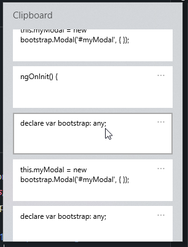

# 20230226: Windows Clipboard History

<TagLinks />

- El otro día ví que un amigo usaba algo así como un clipboard history picker.
- Estoy usando Windows 10.
- Encontré que se puede habilitar entrando a *Settings*, *Clipboard*, *Clipboard history*: On
- Luego de eso, WIN + V para abrir el historial del clipboard
- Referencias
	- [How to enable Clipboard History in Windows 10](https://www.digitional.com/how-to-enable-clipboard-history-in-windows-10/)