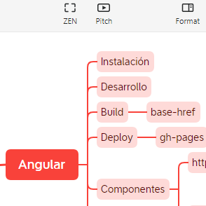

# 20230226: Pitch mode en XMind

- En [XMind](https://xmind.app/), el modo **pitch** permite presentar una serie de diapositivas a partir del midmap.
- Es una característica premium que se puede probar gratis.
- Los slides generados muestran texto negro sobre fondo blanco.
	- Hay más temas que se pueden elegir en *Settings*.
- Referencias
	- Youtube: [How to Present Your Mind Map with Xmind’s NEW Pitch Mode | Feature](https://www.youtube.com/watch?v=Z_4HO47D5Zg&ab_channel=Xmind)