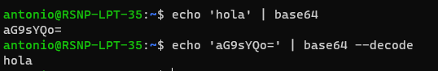

# 20230321: Base64 en Línea de Comandos Bash

- La línea de comando [bash](https://www.hostinger.es/tutoriales/bash-script-linux) es la que se usa por default en [Ubuntu](https://ubuntu.com/download) y otras versiones de Linux.
- También está disponible en Windows si se ha instalado [Git Bash](https://git-scm.com/downloads) o https://learn.microsoft.com/es-es/windows/wsl/install.
- El comando `base64` se permite convertir una cadena de texto en base64.

