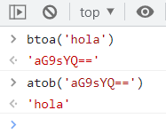

# 20230321: Base64 en Javascript

- El comando `btoa` permite codificar una cadena de texto a base64.

```js
btoa('hola');
// 'aG9sYQ=='
```

- Y, de modo inverso, el comando `atob` permite decodificar base64 a texto normal.

```js
atob('aG9sYQ==')
// 'hola'
```

- Se puede probar rápidamente en la **consola javascript** que está disponible en **Chrome** pulsando F12 ó CTRL + SHIFT + I.



- Referencia: [How To Encode and Decode Strings with Base64 in JavaScript](https://www.digitalocean.com/community/tutorials/how-to-encode-and-decode-strings-with-base64-in-javascript)