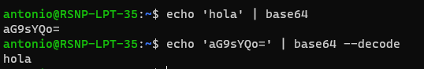

# 20230321: Base64 en Línea de Comandos Bash

- La línea de comando [bash](https://www.hostinger.es/tutoriales/bash-script-linux) es la que se usa por default en [Ubuntu](https://ubuntu.com/download) y otras versiones de Linux.
- También está disponible en Windows si se ha instalado [Git Bash](https://git-scm.com/downloads) o https://learn.microsoft.com/es-es/windows/wsl/install.
- El comando `base64` se permite codificar una cadena de texto a base64.

```bash
echo 'hola' | base64
# aG9sYQo=
```

- Y, de modo inverso, el modificador --decode permite decodificar base64 a texto normal

```bash
echo 'aG9sYQo=' | base64 --decode
# hola
```



- Referencia: [How to base64 encode and decode from command-line](https://www.serverlab.ca/tutorials/linux/administration-linux/how-to-base64-encode-and-decode-from-command-line/)