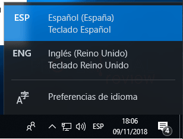
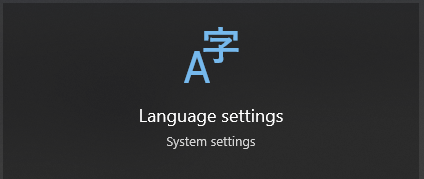
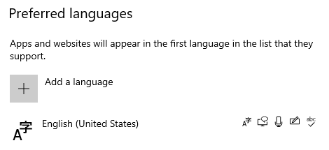
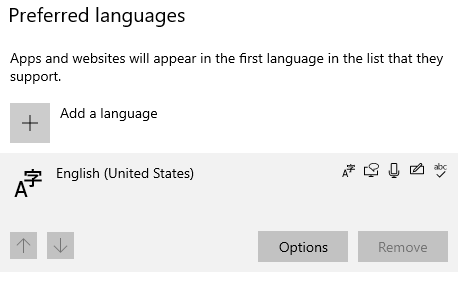
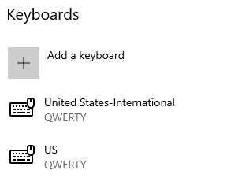

# Windows 10: Cómo alternar el idioma del teclado

<TagLinks />

- WIN + SPACE para alternar entre idiomas para teclado

## Configuración

- WIN, Language Settings, Preferred Languages
	- Add a Language
		- English (United States)
			- Options
				- Keyboard
					- Add a Keyboard
						- United States International
						- US

## Referencias

- [▷ Como cambiar idioma de teclado Windows 10 y otros ajustes de configuración](https://www.profesionalreview.com/2018/11/15/cambiar-idioma-teclado-windows-10/)