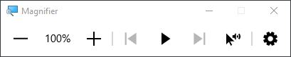

# 20230511: Cómo hacer zooming (magnify) en Windows 10

<TagLinks />

- WIN + PLUS/MINUS
	- Activa el ***Magnifier***
	- 
- Cuando el Magnifier está activo
	- WIN + PLUS para zoom in
	- WIN + MINUS para zoom out
	- WIN + ESC para salir
- **SUPER TIP**: Si el Magnifier se **minimiza**
	- WIN + SCROLL UP/DOWN para zoom in/out
- Referencias
	- [How To Zoom or Magnify In Windows 10 Using The Mouse Scroll Wheel - YouTube](https://www.youtube.com/watch?v=s2UVejK6umQ&ab_channel=JamieWagner)
	- [How to zoom in on your screen in Windows | BrightCarbon](https://www.brightcarbon.com/blog/zoom-in-on-your-screen-in-windows/)