# 20230612: Supresión de ruido en OBS

## Mic Filter: Noise Suppression

- Seleccionar la fuente Mic/Aux, Filter Add, **Noise Suppression**
- 
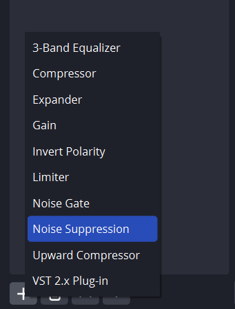

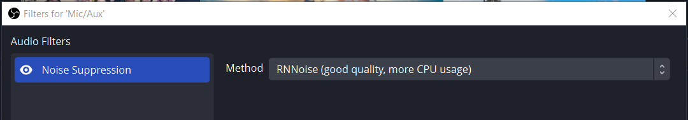

- Para monitorear con unos audífonos la salida, elegir la fuente Mic/Aux, Menú de los tres puntos, Advanced Audio Properties

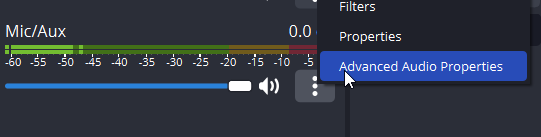

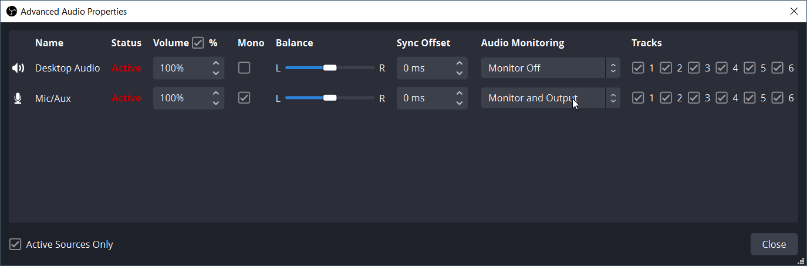

## Mic Filter: VST Plugin

- Instalar el plugin VST
	- [VST 2.x Plugin Filter | OBS](https://obsproject.com/kb/vst-2-x-plugin-filter)
- Seleccionar la fuente Mic/Aux, Filter Add, **VST**

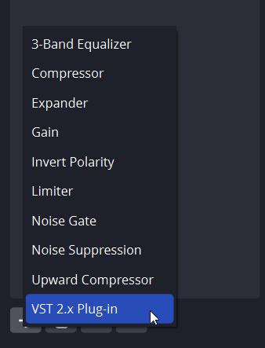

- Elegir **reafir standalone** y abrir la interface

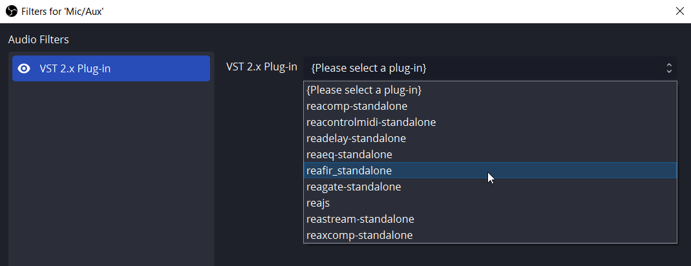

- Elegir Mode: Substract, marcar el check Automatically build noise profile durante unos 30 segundos (para que almacene la info del ruido de fondo), desmarcar y cerrar la interface

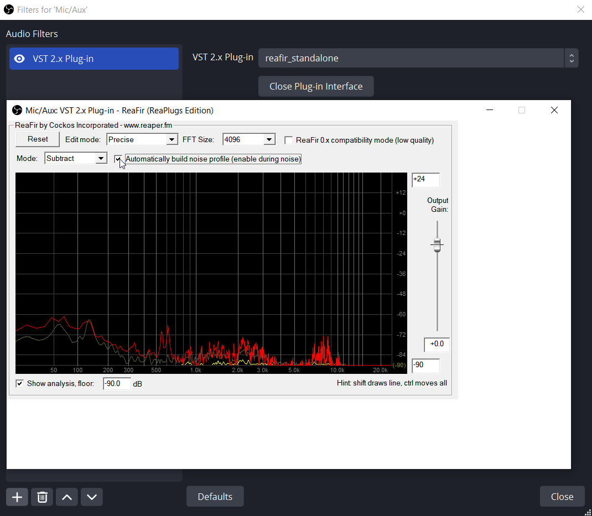
## NVIDIA RTX Voice

- Instalar el software
	- [NVIDIA RTX Voice: Setup Guide | GeForce News | NVIDIA](https://www.nvidia.com/en-us/geforce/guides/nvidia-rtx-voice-setup-guide/)
	- Se puede instalar directamente en Windows 10
		- En algunos tutoriales se sugiere un truco de instalación que, felizmente ya no es necesario con la nueva versión.

- En NVIDIA RTX Voice, elegir el micrófono y marcar Noise Suppression

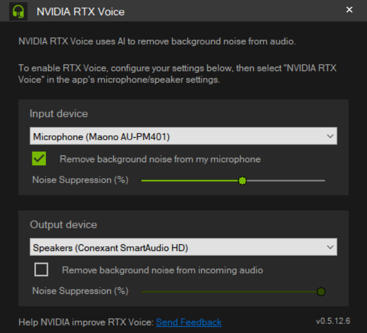

- En OBS, seleccionar la fuente MIc/Aux y elegir como micrófono a NVIDIA RTX Voice

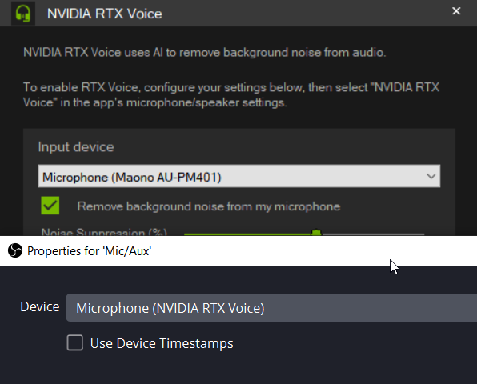

- En mi caso, se introducía un ruido entrecortado. Lo solucioné entrando a Windows Settings, Graphics Settings y configurando OBS para High performance, en lugar del Power saving que estaba

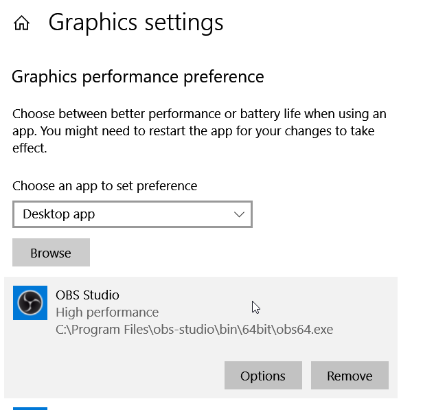

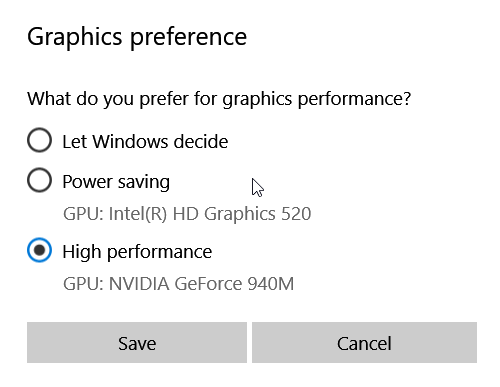

## Krisp.ai

- En Krisp, abrir una cuenta e instalar el software
	- [World’s #1 Noise Cancelling App | Krisp](https://krisp.ai/)
- En la aplicación, elegir el micrófono

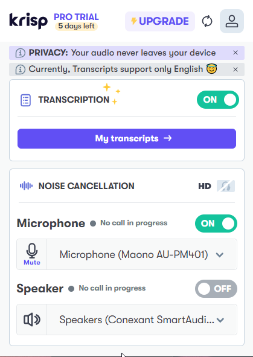

