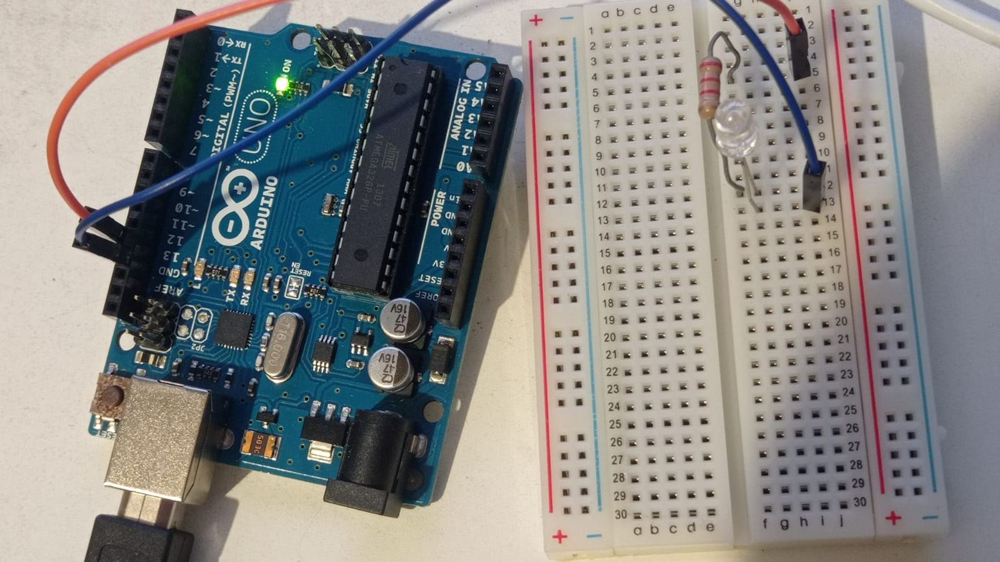

# 20231106: Iniciación a Arduino UNO parpadeando un led

<TagLinks />

## Arduino

- Es hardware open source
	- Origen italiano
	- https://arduino.cc
- Arduino UNO interface
	- DIGITAL: 0 - 13
	- ANALOG IN: !0 - A5

## Flujo de trabajo

- El board se conecta por USB tipo A - B a la computadora
- Se usa Arduino IDE para reconocer el board
- Se carga un sketch.
	- Hay varios en File, examples
		- Por ejemplo, *Basics*, *Blink*
	- El sketch tiene dos funciones
		- setup()
			- Se carga una sola vez, al inicio
		- loop()
			- Se repite indefinidamente luego de setup()
- Se ordena al IDE que haga upload del sketch
- Arduino ejecuta el sketch

## Notas técnicas

- En un **diodo**, la corriente eléctrica fluye en un solo sentido y es bloqueada en el otro
- Un **led** es un diodo emisor de luz.
	- Brilla si está colocado en el sentido adecuado
	- La parte que tiene el **yunque** (típicamente de terminal más corto) es el ***cátodo*** y se conecta a lo **negativo**.
	- La parte que tiene el **bastón** (típicamente de terminal más largo) es el ***ánodo*** y se conecta a lo **positivo**
- El led **no se suele conectar directamente a una fuente**, sino a través de una **resistencia**, para asegurar que no le pase demasiada corriente
	- Por ejemplo, para una fuente de 5 V, para que un led de 3 V use 20 mA, se necesita una resistencia de (5-2) V / 20mA = 100 ohm
- En un **protoboard**
	- Las líneas de los bordes son pistas longitudinales independientes
	- Las líneas a los lados del centro son pistas transversales independientes

## Arduino en TinkerCAD

- Usando TinkerCAD
	- [(331) 01: Hello world! Blink, hacemos parpadear nuestro primer led con Arduino - YouTube](https://www.youtube.com/watch?v=qdxa0ZK-eQE&ab_channel=EspacioFundaci%C3%B3nTelef%C3%B3nicaMadrid)