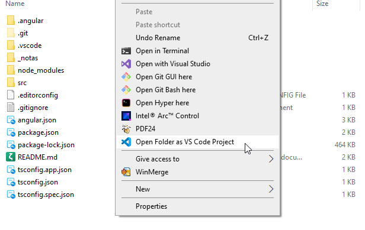

# 20240122: Agregar link contextual Abrir VSCode aquí

- [Right click on Windows folder and open with Visual Studio Code | thisDaveJ](https://thisdavej.com/right-click-on-windows-folder-and-open-with-visual-studio-code/)
- Normalmente, agregar el link contextual que permita abrir una carpeta en vscode se puede lograr corriendo nuevamente el instalador.
- Sin embargo, desinstalé el vscode normal y ahora estoy usando vscode en modo portable, que no agrega esa opción.
- En mi caso, tengo instalado vscode en `D:\apps\vscode-portable\`
- Creo el archivo de registro: vscode-openhere.org

```reg
Windows Registry Editor Version 5.00
; Open files
[HKEY_CLASSES_ROOT\*\shell\Open with VS Code]
@="Edit with VS Code"
"Icon"="D:\\apps\\vscode-portable\\Code.exe,0"
[HKEY_CLASSES_ROOT\*\shell\Open with VS Code\command]
@="\"D:\\apps\\vscode-portable\\Code.exe\" \"%1\""
; This will make it appear when you right click ON a folder
; The "Icon" line can be removed if you don't want the icon to appear
[HKEY_CLASSES_ROOT\Directory\shell\vscode]
@="Open Folder as VS Code Project"
"Icon"="\"D:\\apps\\vscode-portable\\Code.exe\",0"
[HKEY_CLASSES_ROOT\Directory\shell\vscode\command]
@="\"D:\\apps\\vscode-portable\\Code.exe\" \"%1\""
; This will make it appear when you right click INSIDE a folder
; The "Icon" line can be removed if you don't want the icon to appear
[HKEY_CLASSES_ROOT\Directory\Background\shell\vscode]
@="Open Folder as VS Code Project"
"Icon"="\"D:\\apps\\vscode-portable\\Code.exe\",0"
[HKEY_CLASSES_ROOT\Directory\Background\shell\vscode\command]
@="\"D:\\apps\\vscode-portable\\Code.exe\" \"%V\""
```

- Lo ejecuto con un doble click y acepto las solicitudes de permisos.
- Luego, ya aparece la opción.

